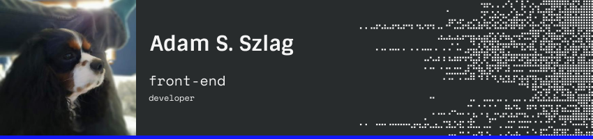

 
# Hello there I am Adam 👋

I am a front-end developer and chess♘ aficionado. Currently I'm living in Poznań, Poland
 

   
### Technologies and tools :wrench:

### Learning :blue_book:

  In progress: 
  Tailwind 
    
  Advanced React hooks 
      
  Rest Api 
      
  Redux 
     
  

  
### Contact :mailbox:

  Feel free to contact me at: a.s.szlag@gmail.com
  
 
